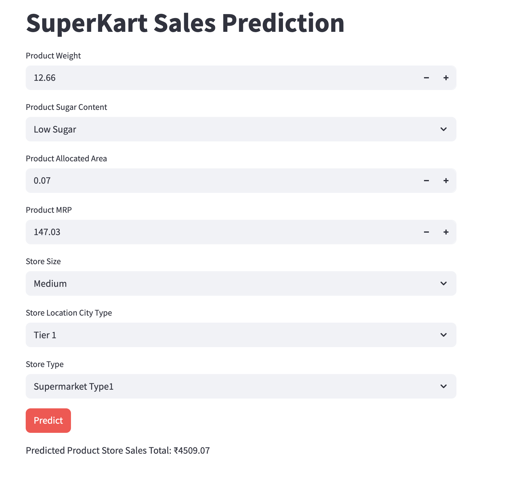

# 🚀 SuperKart Sales Forecasting

An end-to-end machine learning project for forecasting retail product-store sales for the upcoming quarter.

## 📊 Overview

Retail businesses depend on accurate sales forecasts to make smarter decisions around inventory planning, store operations, and regional growth strategy. In this project, I built a machine learning solution that predicts **quarterly sales for products across different SuperKart outlets** using historical store and product attributes.

The project goes beyond model training. It covers the full workflow from **data understanding and preprocessing** to **model development, evaluation, serialization, API deployment, and frontend integration**.

This repository demonstrates my ability to take a business problem and turn it into a production-oriented data product.

---
## 🧠 Demo


<center> </center>

---


## ✍️ Business Problem

SuperKart operates a network of retail outlets and needs a reliable way to estimate future sales at the product-store level. Without accurate forecasts, the business risks:

- Overstocking slow-moving products
- Understocking high-demand products
- Missing revenue opportunities
- Making weak regional expansion decisions
- Poor allocation of shelf space and store resources

The goal of this project was to build a forecasting system that helps stakeholders estimate future sales more confidently and use those predictions to support operational and strategic decisions.

---

## 🤖 Project Objective

The objective was to develop a machine learning model that predicts `Product_Store_Sales_Total` based on product and store-level features such as:

- Product weight
- Sugar content
- Allocated display area
- Product type
- Product MRP
- Store size
- Store type
- Store establishment year
- Store city tier

The final solution was packaged for practical use through:

- a **Flask backend API** for predictions
- a **Streamlit frontend** for interactive input and result display
- containerized deployment using **Docker**

---

## 📌 What I Built

This project includes:

- A structured exploratory data analysis workflow
- Data cleaning and feature engineering
- Model training using ensemble regressors
- Hyperparameter tuning and model comparison
- Model serialization for reuse
- A backend prediction service using Flask
- A frontend user interface using Streamlit
- A deployable, modular architecture suitable for real-world usage

---

## 📈 End-to-End Project Flow

## 1. Problem Framing

I started by translating the business need into a supervised regression problem:

**Predict total product-store sales for the next quarter**

This meant identifying the target variable, understanding the available predictors, and framing the project around business usefulness rather than only model accuracy.

---

## 2. Data Understanding

The dataset contains information about products and stores, including identifiers, pricing, store characteristics, and the target sales variable.

Key fields include:

- `Product_Id`
- `Product_Weight`
- `Product_Sugar_Content`
- `Product_Allocated_Area`
- `Product_Type`
- `Product_MRP`
- `Store_Id`
- `Store_Establishment_Year`
- `Store_Size`
- `Store_Location_City_Type`
- `Store_Type`
- `Product_Store_Sales_Total` (target)

At this stage, I inspected the structure of the data, reviewed missing values, checked duplicates, and assessed feature quality before modeling.

---

## 3. Exploratory Data Analysis (EDA)

I performed univariate and bivariate analysis to understand how product and store attributes influence sales.

This stage helped uncover patterns such as:

- which product categories contribute most to revenue
- how store characteristics affect performance
- how pricing and product placement relate to sales
- which outlet profiles are associated with stronger outcomes

EDA was critical for both feature selection and business interpretation. It also helped ensure the modeling strategy aligned with real revenue drivers.

---

## 4. Data Cleaning and Feature Engineering

To improve model readiness, I applied several preprocessing steps:

### Data cleaning
- corrected inconsistent category labels in `Product_Sugar_Content`
- reviewed data quality issues and handled them before training

### Feature engineering
- derived `Product_Id_char` from `Product_Id`
- calculated `Store_Age_Years` from `Store_Establishment_Year`
- grouped product categories into broader business-friendly buckets such as:
  - `Perishables`
  - `Non Perishables`

### Feature selection
I removed columns that were less useful for direct modeling after extracting their more informative components.

### Encoding
Since the dataset contains categorical variables, I used **OneHotEncoder** within a preprocessing pipeline to transform them for machine learning.

---

## 5. Train-Test Split

To evaluate generalization properly, I split the data into training and testing sets using a **70:30 ratio**.

This ensured the final evaluation reflected how the model would behave on unseen data rather than memorized training patterns.

---

## 6. Model Development

I trained and compared two ensemble regression models:

- **RandomForestRegressor**
- **XGBoostRegressor**

These models were selected because they are strong baselines for structured tabular data and can capture nonlinear relationships between features and target values.

The goal at this stage was not only to maximize performance, but also to assess model stability, interpretability, and deployment practicality.

---

## 7. Hyperparameter Tuning and Evaluation

I used **GridSearchCV** to tune both models and compare tuned versus untuned performance.

### Evaluation metrics
The models were evaluated using:

- **R-squared**
- **MAPE (Mean Absolute Percentage Error)**

### Final outcome
The models performed similarly, and hyperparameter tuning did not produce a meaningful gain over the default configuration.

Because of that, I selected the **untuned RandomForestRegressor** as the final model due to its:

- competitive performance
- simpler configuration
- practical maintainability for deployment

---

## 8. Model Serialization

Once the final model was selected, I serialized it using **joblib** so it could be reused without retraining.

This step is important in real-world ML systems because it separates training from inference and enables efficient deployment in production environments.

---

## 9. Backend API Development

To operationalize the model, I created a **Flask API** that:

- loads the trained model
- accepts prediction inputs in JSON format
- returns predicted sales values

This backend layer makes the forecasting engine reusable by other applications and interfaces.

---

## 10. Frontend Application

I built a **Streamlit application** to provide an interactive user experience where users can:

- enter product details
- choose store attributes
- submit data for prediction
- view forecasted sales output

This turned the ML model into something accessible to non-technical stakeholders.

---

## 11. Deployment Architecture

To make the solution deployment-ready, I packaged the applications using **Docker** and structured the project as a simple microservice-style setup:

- **Flask backend** for inference
- **Streamlit frontend** for user interaction

This architecture improves modularity and makes the system easier to test, deploy, and extend.

---

## 📌 Results

The final models delivered solid and consistent performance on the test set.

### Performance summary
- **R-squared:** ~0.668
- **MAPE:** ~18.7%

### 💡 Interpretation
- The model explains about **66.8% of the variance** in sales
- On average, predictions differ from actual sales by roughly **18.7%**

For a retail forecasting use case based on structured historical features, this is a meaningful result and provides a useful baseline for planning and optimization.

---

## 💡 Business Insights Generated

Beyond prediction, the analysis revealed useful business takeaways:

- some product categories contribute disproportionately to revenue
- some store types and city tiers outperform others
- top-performing outlets may offer patterns worth replicating
- lower-performing outlets may require operational review
- the forecasting system can support more informed stocking and expansion decisions

This is an important part of the project because the work is not just about model accuracy. It is also about generating insights that decision-makers can act on.

---

## 🧠 Tech Stack

### Languages and libraries
- Python
- Pandas
- NumPy
- Matplotlib
- Seaborn
- Scikit-learn
- XGBoost
- joblib

### App and deployment tools
- Flask
- Streamlit
- Docker

---

## ⚡ Repository Structure

```bash
sales-forecast/
├── backend_files/      # Flask API files and serialized model artifacts
├── data/               # Input datasets used for training and evaluation
├── frontend_files/     # Streamlit user interface files
├── notebooks/          # Exploratory analysis, preprocessing, and modeling notebooks
├── screenshots/        # UI or results screenshots
└── README.md
